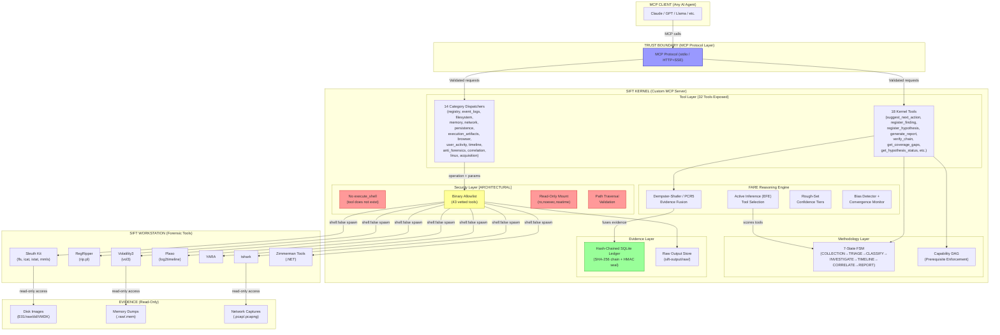
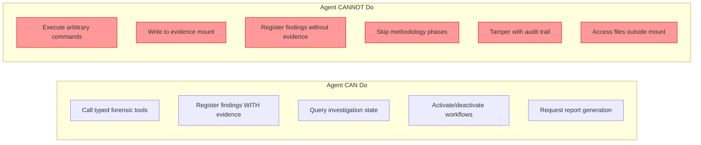

# Architecture Diagram

**Pattern: Custom MCP Server (Pattern #2)**



## Security Boundaries



## Data Flow

```
Evidence Image (E01) ──ro mount──▶ SIFT Tools ──stdout──▶ Parser ──▶ Ledger Entry
                                                                         │
                                                                         ▼
Agent ──MCP call──▶ Dispatcher ──▶ Executor ──shell:false──▶ Binary     │
                                                                         │
Ledger Entry ──evidence_id──▶ register_finding() ──▶ Finding (CONFIRMED/INFERRED)
                                                         │
Finding ──▶ FARE Fusion ──▶ Hypothesis Status (SUPPORTED/REFUTED/OPEN)
                                    │
                                    ▼
                        generate_report() ──▶ HTML/MD/JSON + HMAC seal
```
