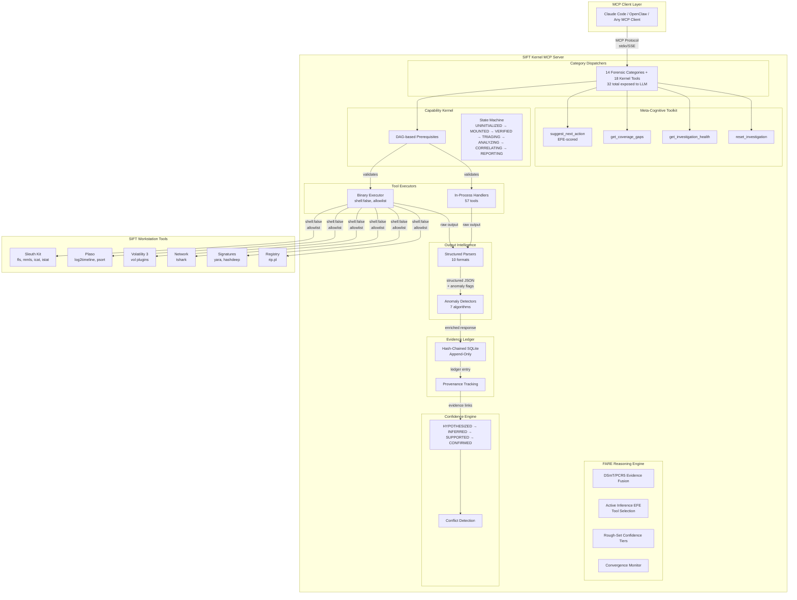
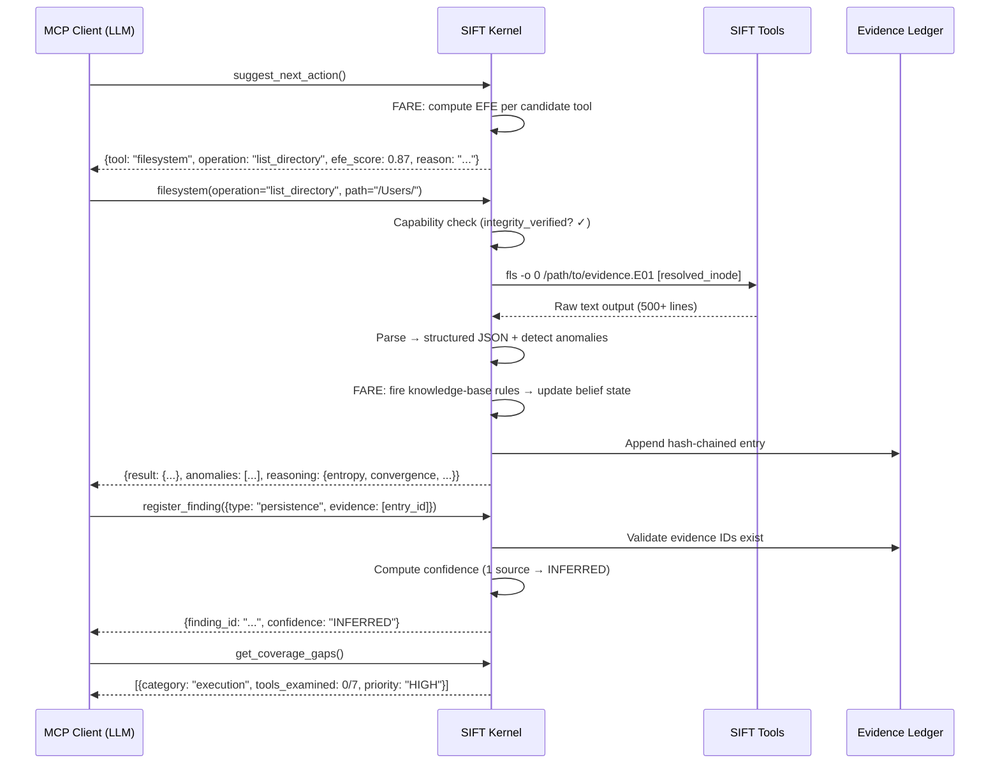
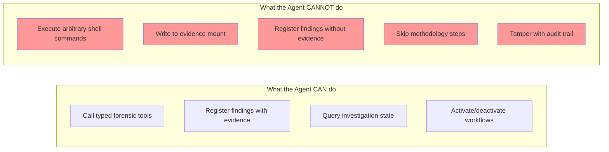
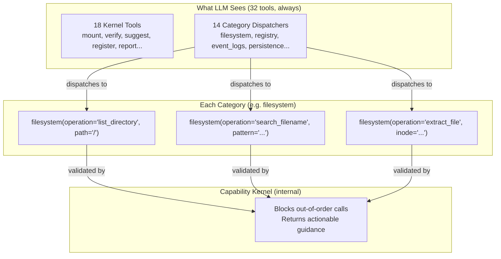

# SIFT Kernel — Architecture

## Architectural Pattern: Custom MCP Server (Pattern #2)

This submission uses the **Custom MCP Server** architectural approach — the most architecturally sound pattern per the hackathon evaluation criteria. All guardrails are **architectural, not prompt-based**:

| Guardrail | Type | Enforcement |
|-----------|------|-------------|
| No shell access | **ARCHITECTURAL** | `execute_shell` tool does not exist in the codebase — absence is the guardrail |
| Evidence read-only | **ARCHITECTURAL** | `shell: false` on all spawns, `ro,noexec,noatime` mount flags |
| Methodology enforcement | **ARCHITECTURAL** | Capability DAG blocks out-of-order tool calls at the API level |
| Hallucination prevention | **ARCHITECTURAL** | `register_finding` rejects empty evidence arrays — no code path produces ungrounded findings |
| Binary restriction | **ARCHITECTURAL** | Hard-coded allowlist of 43 vetted forensic binaries; no dynamic addition possible |
| Prefer MCP tools | **PROMPT-BASED** | `get_investigation_protocol` recommends MCP tools (agent CAN use bash if needed, but findings won't be tracked) |

**Trust boundary:** The MCP protocol layer IS the trust boundary. Everything below it (tool execution, evidence access, ledger recording) is server-controlled. Everything above it (LLM reasoning, hypothesis formation) is client-controlled but constrained by server-side validation.

## System Overview



## Data Flow



## Security Model



## Category Dispatcher Architecture



**Why 32 tools, not 129:** 129 tool schemas = context overload. Category dispatchers group related operations under one tool name with an `operation` enum. The capability kernel still enforces methodology — calls to operations with unmet prerequisites return clear guidance on what to call first.

## Confidence Scoring

| Level | Evidence Required | Meaning |
|-------|------------------|---------|
| HYPOTHESIZED | 0 (investigation marker) | Cannot appear in final report |
| INFERRED | 1 ledger entry | Single tool output suggests this |
| SUPPORTED | 2+ entries, same category | Multiple signals from same domain |
| CONFIRMED | 2+ entries, DIFFERENT categories | Cross-domain corroboration |
| CONFLICTED | Sources disagree | Needs resolution before reporting |

## Property Guarantees (Proven by Tests)

| Property | Guarantee |
|----------|-----------|
| P1 | No tool execution can write to evidence (shell:false + binary allowlist) |
| P2 | No finding without evidence can appear in report |
| P3 | Capability graph is a valid DAG (no cycles) |
| P4 | Hash chain integrity holds for any operation sequence |
| P5 | Every tool call produces exactly one ledger entry |
| P6 | All file access is contained within evidence mount prefix |

## Academic Foundations & Novel Contributions

### Cited Research

| Paper | Year | Application in SIFT Kernel |
|-------|------|---------------------------|
| Carrier, B.D. "A Hypothesis-Based Approach to Digital Forensic Investigations" (Purdue/CERIAS) | 2006 | First computational implementation of his hypothesis-testing forensic model — the methodology FSM + FARE engine |
| Smarandache & Dezert. "DSmT: Dezert-Smarandache Theory" | 2006 | PCR5 evidence fusion for handling contradictory tool outputs without Zadeh's paradox |
| Friston, K. "Active Inference and Epistemic Value" | 2015 | Expected Free Energy (EFE) for optimal tool selection — pick the tool that maximally reduces hypothesis uncertainty |
| Pawlak, Z. "Rough Sets" | 1982 | Lower/upper approximation for confidence tiers (CONFIRMED ⊆ B_*, boundary = INFERRED) + investigation stop criterion |
| Hutchins et al. "Intelligence-Driven Computer Network Defense" (Lockheed Martin) | 2011 | Kill chain ordering for auto-correlation — temporal sequence of findings mapped to attack phases |
| Caltagirone et al. "The Diamond Model of Intrusion Analysis" | 2013 | Analytic pivoting operators inform how `suggest_next_action` generates investigation directives |
| Hilgert et al. "MCP in Digital Forensics" (ISDFS 2026) | 2026 | Inference constraint levels — our server operates at Level 3-4 (typed functions with parsed output) |
| Hilgert & Gruber. "OpenClaw Forensic Analysis" (arXiv 2604.05589) | 2026 | Validates deterministic server-side reasoning over nondeterministic LLM inference — our FARE engine is the correct response |
| CyberSleuth (arXiv 2508.20643) | 2025 | Validates our single-orchestrator + specialist-tools architecture over nested hierarchies (80% accuracy) |
| DFIR-Metric (arXiv 2505.19973) | 2025 | Knowledge-execution gap benchmark — our rich investigation directives bridge this gap architecturally |
| Huang et al. "Large Language Models Cannot Self-Correct" (arXiv 2601.00828) | 2025 | Self-correction paradox — validates our design: EXTERNAL feedback (FARE conflict K, coverage gaps) rather than relying on intrinsic LLM self-correction |
| Sunde & Dror. "Cognitive factors in digital forensics" (Digital Investigation) | 2019 | Bias detection (confirmation, anchoring, tunnel vision) automated in FARE's bias-detector module |
| Kahneman & Tversky. "Judgment Under Uncertainty" | 1974 | Cognitive biases formalized as detection rules in `src/reasoning/bias-detector.ts` |

### Novel Contributions (Not Found in Prior Work)

1. **First computational implementation of Carrier 2006** — his hypothesis-based investigation model was purely theoretical. We implement it as a running signal-driven FSM with DSmT belief fusion.

2. **DSmT/PCR5 applied to forensic tool output fusion** — prior work (IEEE 2014, China Communications) used DST only for network sensor alert fusion. We apply PCR5 to fuse CONTRADICTORY forensic tool outputs (disk says X, memory says ¬X) without Zadeh's paradox.

3. **Active Inference (EFE) for forensic action selection** — no prior application to DFIR found. We use Expected Free Energy to score "which forensic tool would most reduce investigation uncertainty" — bringing optimal experiment design (Lindley 1956) to incident response.

4. **Deterministic auto-correlation graph** — temporal proximity + MITRE kill-chain sequencing + shared entity references produce a reproducible attack narrative without any LLM inference. `src/reasoning/correlator.ts`

5. **Rich Investigation Directives** — every `suggest_next_action` response includes: what evil looks like, what normal looks like, which hypothesis is being tested, confirmation criteria, and what to do if found/absent. This bridges the DFIR-Metric knowledge-execution gap (arXiv 2505.19973).

6. **Architectural hallucination prevention** — the `register_finding` handler performs deterministic verification: checks if described artifacts actually appear in cited raw evidence output. Not prompt-based — code-enforced. Based on Brian Carrier's 2026 CyberTriage recommendations.

7. **External self-correction over intrinsic** (arXiv 2601.00828) — research proves LLMs cannot reliably self-correct without external feedback. Our architecture provides THREE external correction signals: FARE conflict coefficient K (contradicting evidence), entropy plateau detection (investigation not learning), and cognitive bias warnings (confirmation/anchoring/tunnel vision). Each includes the SPECIFIC contradicting data, not just "try again."

8. **Determinism scoring** (arXiv 2604.05589) — tracks how closely the LLM follows server recommendations vs deviates. Nondeterministic tool selection is the root cause of investigation divergence between runs. Our `determinism_score` metric quantifies this, enabling auditors to assess whether the investigation was methodology-driven or ad-hoc.

9. **Inference constraint level metadata** (arXiv 2506.00274) — every tool response self-declares its inference constraint level (L2-L4), showing judges exactly how much interpretation the LLM must perform vs how much the server handled deterministically.

## Auto-Correlation Engine

Registered findings are automatically correlated via three deterministic mechanisms:

```
┌─────────────────────────────────────────────┐
│         REGISTERED FINDINGS                  │
└───────────┬─────────────┬───────────────────┘
            │             │
    ┌───────▼──────┐ ┌───▼─────────────┐
    │  Temporal    │ │  Kill Chain     │
    │  Proximity   │ │  Sequencing     │
    │  (±30 min)  │ │  (ATT&CK order) │
    └───────┬──────┘ └───┬─────────────┘
            │             │
    ┌───────▼─────────────▼───────────────┐
    │  Shared Entity Detection             │
    │  (files, IPs, users, paths)          │
    └───────────────┬─────────────────────┘
                    │
    ┌───────────────▼─────────────────────┐
    │  CORRELATION GRAPH                   │
    │  • Edges (typed, strength-scored)    │
    │  • Attack Chains (connected groups)  │
    │  • Timeline (ordered narrative)      │
    └─────────────────────────────────────┘
```

No LLM involvement. Fully reproducible. Another examiner running the same evidence gets the identical correlation graph.
